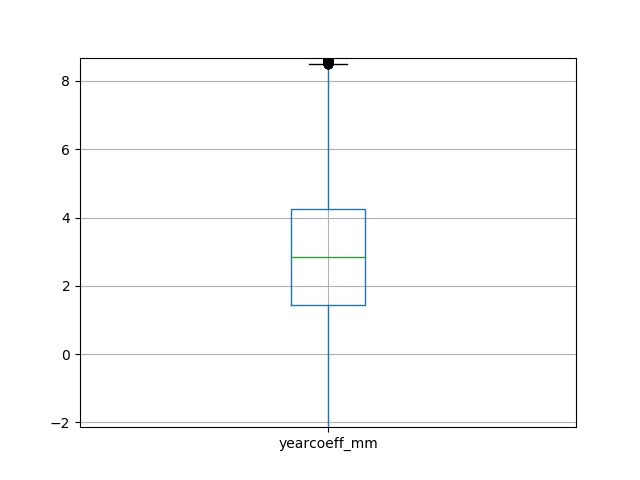
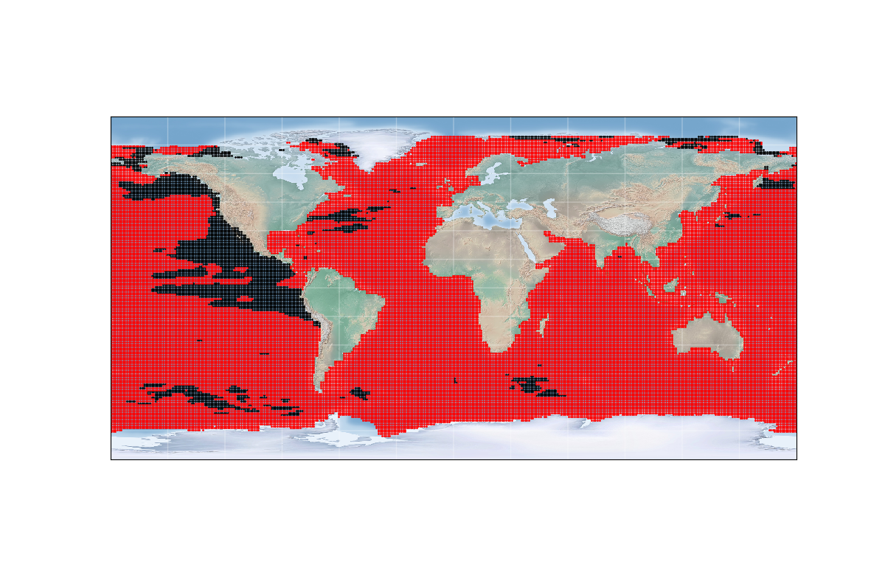
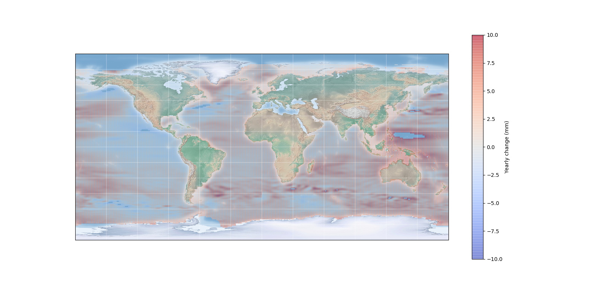

# SpaceApps Rising Sea levels python model

In this project we took satellite sea level data from NASA AVISO 1992 - 2010 dataset, which was used to generate a linear model for each coordinate (longitude/latitude pair) that was then used to predict into the future at set year intervals. 

This model is an example of the minimum viable results and serves as an example workflow inluding data wrangling, modeling and visualization. 

The final results rely on two `.py` files:

* `extract_model.py` extracts the .nc files in the /data subdirectory. when the script was run the /data subdirectory only had nc files. it was designed to handle file batches but it was ultimately unnecessary in the end. Each set of data for a coordinate point is individually modeled and then the modeling results are stored in the `output.csv`
* `visualizaion.py`. takes the output csv file and makes some simmple statistical plots (such as boxplot of slope, which would be the yearly rise in sea level mm of all the coordinate points) as well as a colored/gradient map of rising sea level

Other files, such as `test.py` and `test2.py` were to test the metadata extraction from a variety of similar `.nc` files when initially starting out, with the results in results.txt. Essentially many of these files have columns with extensive metadata, so we sometimes wanted to get a 'report' to browse through when choosing columns to extract. 

